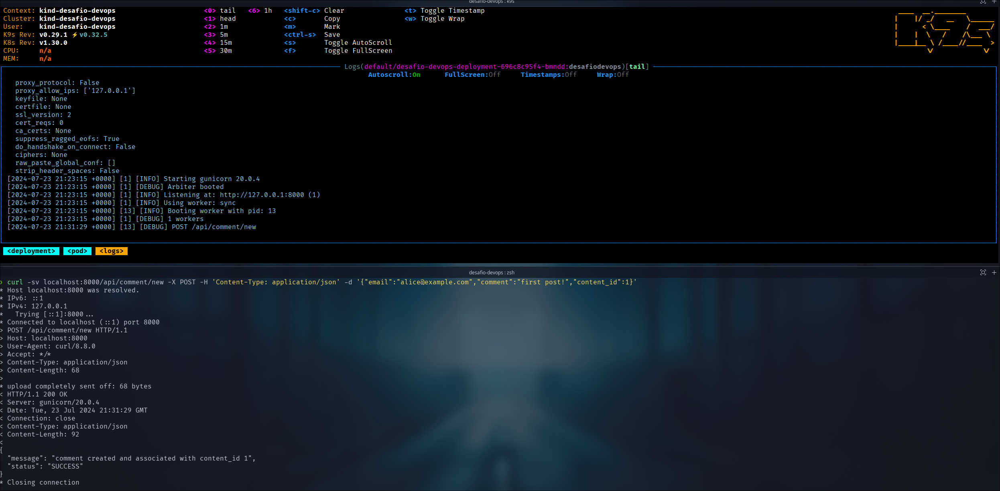

# Docs para registrar os testes e deploys

## Passos para rodar o desafio

Para iniciar basta rodar o comando abaixo:

```bash
task start
```

Com esse comando vai iniciar a pipeline, ela tem os passos:

- task: terraform-all
- task: build
- task: docker-push
- task: kubectl-apply
- task: port-forward
- task: k6-test

O log desse comando pode ser visto no arquivo [start.log](start.log)

Isso criara todo o ambiente ja com o build e a entrega da aplicação.

Segue os prints para demostrar todas as entregas:

Aqui o print do cluster criado:


Aqui um print do deployment e da aplicação rodando:


Segue um print do curl para testar a aplicação e com o log do pod sendo mostrado via k9s:


Para os outros vou deixar o log como arquivo de texto: [curl.log](curl.log)

Segue um print dos comandos que mostram o resultado:


O processo de start vai fazer o port-foward e vai iniciar os tests usando o k6.

os logs desse procedimento pode ver no [test.json](test.json)

Com isso fica a documentação de como rodar o desafio e os resultados obtidos.
